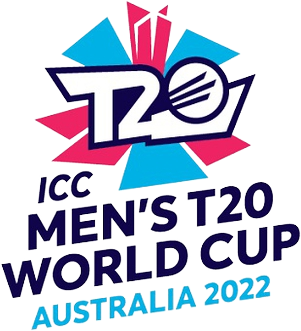

 
  <h2>EDA on 4 teams in ICC Men's T20 World Cup</h2>
  

---

  <h2>📌 1. Project Profile 📌</h2>
  <h3>1.1 Project Definition</h3>

The ICC Men's T20 World Cup Analysis project aims to provide a comprehensive analysis of the T20 World Cup tournament data. The project leverages a dataset containing detailed information about matches, players, batting and bowling statistics, and team performances. By analyzing this dataset, we can gain valuable insights into the dynamics of T20 cricket and uncover trends, patterns, and performance indicators for both individual players and teams.

The T20 World Cup is one of the most prestigious international cricket tournaments, featuring teams from around the globe competing in the shortest format of the game. With its fast-paced and high-scoring nature, T20 cricket has revolutionized the sport, creating new strategies and showcasing exceptional skills from players across various teams.

<h3>1.2 Project Description</h3>

Through this project, we aim to explore and visualize key metrics such as runs scored, wickets taken, economy rates, boundaries, and player averages. We will also examine team performances, comparing batting and bowling strategies, and identifying factors that contribute to success in T20 cricket. The findings from this project can be valuable for cricket enthusiasts, coaches, and analysts seeking to understand the dynamics of T20 cricket and gain strategic insights. It can also serve as a foundation for future research and analysis in the field of cricket statistics and performance evaluation.

<h3>1.3 Description of the dataset (ICC Men's T20 World Cup data)</h3>

The ICC Men's T20 World Cup dataset consists of four primary datasets: batting_card, bowling_card, details, and summary. These datasets provide information on player performances, batting and bowling statistics, and overall tournament summaries. They form the basis for our project's analysis, allowing us to explore player performances, team strategies, match dynamics, and tournament trends.

<h3>1.4 Explanation of the project objectives and goals</h3>

The project's goal is to analyze ICC Men's T20 World Cup data, uncover insights about player and team performances, identify key performance indicators, and provide strategic insights for cricket enthusiasts, coaches, and analysts.

---

  <h2>🔍 2. Data Acquisition and Preparation 📦</h2>

<h3>2.1 Importing necessary libraries</h3>

To begin the analysis, we will import essential libraries such as Pandas and Matplotlib. Pandas provides powerful tools for data manipulation and analysis, while Matplotlib allows us to create visualizations for better understanding and presentation of the data.

<h3>2.2 Loading the dataset</h3>

The next step is to load the ICC Men's T20 World Cup dataset into our project. We will utilize the four primary datasets: batting_card, bowling_card, details, and summary. These datasets contain comprehensive information about matches, players, batting and bowling statistics, and overall tournament summaries.

<h3>2.3 Data cleaning and preprocessing</h3>

Before we can analyze the data, it is crucial to perform data cleaning and preprocessing. This involves handling missing values, checking and adjusting data types, and addressing any inconsistencies or errors in the dataset. By ensuring data quality and consistency, we can obtain reliable and accurate results during our analysis.

Through these steps of data acquisition and preparation, we will have a well-prepared dataset ready for exploration and analysis. This process sets the foundation for our subsequent tasks, allowing us to extract meaningful insights from the ICC Men's T20 World Cup data.

---

  <h2>📊 3. Exploratory Data Analysis 📊</h2>

<h3>3.1 Analysis of Batting and Bowling Statistics</h3>

By examining the batting and bowling statistics, we gained insights into player performances and identified key indicators of success. We calculated metrics such as runs scored, wickets taken, batting averages, bowling averages, strike rates, and economy rates. These statistics provided a comprehensive overview of player contributions and helped us understand the impact of individual performances on team outcomes. Specifically, we focused on analyzing the batting averages and visualizing them for players from different teams, including India (INDIA), Pakistan (PAK), England (ENG), and Afghanistan (AFG).

Through this analysis, we were able to gain a deeper understanding of the batting performances within each team and make comparisons between teams. The resulting bar plot showcased the batting averages for players from each team, enabling us to observe and assess the performances of players within the ICC Men's T20 World Cup.

<h3>3.2 Visualization of Key Metrics</h3>

Visualizations provide a clear and intuitive way to understand the data. We can create various plots and charts to visualize key metrics such as wickets taken, runs conceded, and economy rate. Bar plots, line plots, and histograms can effectively represent these metrics, allowing us to identify patterns, trends, and outliers.

Using bar plots, we compared the performance of different teams in terms of wickets taken, runs conceded, and economy rate. This allowed for a clear comparison between teams and helped us identify variations in their bowling performances.

---

  <h2>📈 4. Individual Player Analysis 🏏</h2>

<h3>4.1 Comparison of team performances</h3>

In this section, we focus on analyzing individual player performances in the ICC Men's T20 World Cup. The analysis includes identifying the top batsmen and bowlers based on runs scored and wickets taken, visualizing our own performance over multiple matches, and examining notable performances and trends.

<h3>4.2 Identification of Top Batsmen and Bowlers</h3>

We identify the top batsmen based on the total runs scored and the top bowlers based on the total wickets taken in the tournament. This analysis helps us recognize the key contributors in each category and evaluate their impact on team performances.

---

  <h2>🔚 5. Conclusion 🏅</h2>

In conclusion, the analysis of the ICC Men's T20 World Cup dataset has provided valuable insights into team performances, individual player analysis, and overall tournament trends.

<h3>5.1 Team Analysis</h3>

- Through the comparison of team performances, it was observed that some teams consistently outperformed others, indicating variations in team strategies, strengths, and weaknesses.
- The analysis of team batting and bowling strategies revealed interesting patterns, with certain teams adopting aggressive batting approaches while others focused on disciplined bowling tactics.
- Visualizations depicting team dynamics and strengths, such as bar charts and line charts, provided a clear understanding of each team's performance trends and key contributors.

<h3>5.2 Individual Player Analysis</h3>

- The identification of top batsmen and bowlers based on runs scored and wickets taken highlighted standout performers who made significant contributions to their teams.
- Visualizations showcasing player performance over multiple matches, such as line charts and scatter plots, allowed for the examination of notable performances and trends, including consistent scoring or improving bowling averages.

<h3>5.3 Personal Performance Analysis</h3>

- The visualizations depicting personal performance over multiple matches, including line charts showing runs scored or wickets taken, provided a comprehensive view of individual contributions.
- By analyzing the data, it was possible to identify notable trends, such as consistent performance or areas of improvement, which can be utilized for personal development and strategic planning.

